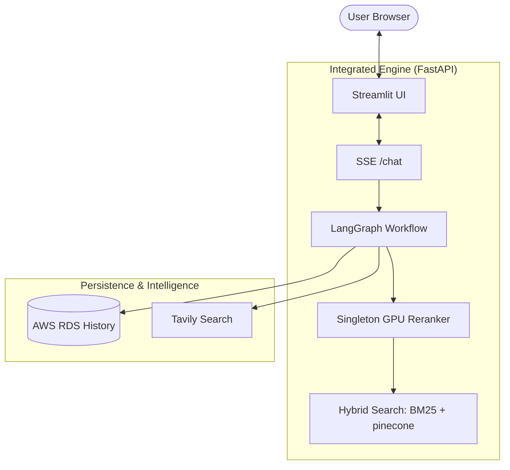

# WELD·BOT v3.2 (All-in-One Arc Flash Edition)
---
# 1. 팀 소개
  
   ## 팀명 
    
   ## 팀원 소개 
|이름|역할|GitHub|
|------|---|---|
|김도영|팀장|[](https://github.com/rubyheartsping)|
|김민정|팀원|[](https://github.com/minjeong-kim-dev)|
|김승훈|팀원|[](https://github.com/seunghun92-lab)|
|송주엽|팀원|[](https://github.com/JUYEOP024)|
|정희영|팀원|[](https://github.com/JUNGHEEYOUNG9090)
    
# 2. 개발 배경

로봇 용접 매뉴얼은 복잡한 공정 조건과 다양한 장비 설정을 포함하고 있어, 숙련 작업자가 아니면 이해하기 어렵다는 한계가 있다.
또한 매뉴얼 관리가 비효율적으로 이루어질 경우, 품질 저하 및 작업 오류로 이어질 수 있다.

본 개발은 LLM 기반 문서 분석 및 생성 기술을 적용하여, 로봇 용접 매뉴얼을 자동으로 생성·요약하고, 상황별 가이드를 제공하여 제조업에 뛰어드는 지원자, 신입은 물론 숙련자들에게도 도움을 줄 수 있는 시스템을 구현하는 것을 목표로 한다.  
# 3. 기술 스택 및 사용 모델
## 기술스택
 

# 4. 아키텍쳐 및 플로우차트

## 시스템 아키텍쳐


## Branch 구조
```
main
 └──develop
      ├── heartsping     # 김도영 작업 브랜치
      ├── kmj            # 김민정 작업 브랜치
      ├── sjy            # 송주엽 작업 브랜치
      ├── ssh            # 신승훈 작업 브랜치
      └── jhy            # 정희영 작업 브랜치
```

## AWS 배포 설계

```
[사용자 브라우저]
       │
       ▼
[Application Load Balancer]
       │
       ▼
[EC2 / ECS] ── FastAPI (app/main.py)
       │              │
       │         [LangGraph 워크플로우]
       │              │
       │    ┌─────────┴──────────┐
       │    ▼                   ▼
       │ [OpenAI API]    [S3 RAW_DATA]
       │                        │
       │                   ingest_all.py
       │                        │
       │                        ▼
       └───────── [RDS PostgreSQL + Pinecone + S3]
       
```

### 폴더 및 파일 구조
```
WELD-BOT v4.0 Project
├── .env                  # 로컬 환경 변수 설정
├── README.md             # 프로젝트 소개 문서
├── PROJECT_STRUCTURE.md  # 현재 보고 계신 아키텍처 및 로직 명세서
├── run_tunnel.py         # DB 접근을 위한 백그라운드 SSH 터널링 유지 스크립트
├── run_all.py            # 백엔드(FastAPI)와 프론트엔드(Streamlit) 동시 실행 마스터 런처 (v3.1 적용)
├── run_all.bat / .sh     # OS별 실행 쉘 스크립트
├── kill_all.bat / .sh    # 프로세스 강제 종료용 쉘 스크립트
├── marker.py             # 멀티 GPU 기반 PDF 분산 파싱 및 마크다운 변환 파이프라인 스크립트
├── main.py               # 백엔드 통합 FastAPI 메인 서버 (RAG, Chat, Auth, Admin 라우터 포함 인증 연동판)
├── v4_app.py             # 프론트엔드(Streamlit) 메인 애플리케이션 (v4.0 엔트리포인트)
├── pyproject.toml / poetry.lock # 패키지 의존성 관리
├── app/                  # 핵심 아키텍처 및 백엔드 로직 중심 폴더
│   ├── main.py           # 단일 API 테스트용 분리된 FastAPI 엔트리포인트
│   ├── app_logic.py      # LangGraph 기반 스트리밍 스트림 추출 처리 모듈
│   ├── api/              # FastAPI API 라우터
│   │   ├── auth_api.py   # JWT 기반 로그인, 회원가입, 소셜(OAuth) 로그인 로직 및 미들웨어
│   │   └── routes/
│   │       ├── chat.py   # 채팅 스트리밍 (SSE) 및 단건 응답 엔드포인트 라우터
│   │       └── admin.py  # 관리자용 PDF 업로드 파일 파싱 파이프라인 API 라우터
│   ├── agents/           # LangGraph 기반 워크플로우 및 AI Agent 모듈
│   │   ├── graph.py      # LangGraph 노드 연결 및 상태 제어 (도메인 재분류/할루시네이션 검증 3중 안전 로직)
│   │   ├── stream.py     # GraphState 기반 통합 비동기 발생기(Event Generator) 제어
│   │   ├── supervisor.py # 의도 파악 및 도메인 분류(Technical/Social) 판단 에이전트
│   │   ├── specialists/  # 분야별(로봇, 용접, 전기, 일반, 인사말) 전문 에이전트 모듈
│   │   └── tools/        # 질의 재작성(Rewriter/Feedback) 등 유틸리티 에이전트
│   ├── core/             # 공통 코어 모듈 (설정, 베이스 DB, 프롬프트, 보안)
│   │   ├── config.py     # 환경 변수 검증 및 전역 Config 세팅(기기별 디바이스 체크)
│   │   ├── database.py   # PostgeSQL 연결, SSH 터널링 관리, 유저/채팅 로깅 체계 공통 모듈
│   │   ├── history.py    # LangGraph 대화 기록용 AsyncPostgresSaver 연동 및 저장
│   │   ├── prompts.py / prompts_mj.py # 에이전트별 시스템 프롬프트 모음
│   │   └── security.py   # 환각 감지(Hallucination Verification) 보안 노드 모델 검증
│   ├── infrastructure/   # 외부 연동 인프라 연계 계층
│   │   └── aws/          # Bedrock(LLM), OpenSearch, S3 연동 클라이언트 및 RDS(PgVector) 통신
│   ├── ingest/           # 데이터 수집 및 전처리 파이프라인 (Chunking 문서 벡터화 등)
│   ├── rag/              # RAG (검색 증강 생성) 핵심 파이프라인
│   │   ├── pipeline.py   # Reranker와 Hybrid Retriever를 결합한 Advanced RAG 메인 함수
│   │   ├── reranker.py   # Cross-Encoder (BGE-M3 등) 기반 문서 순위 재조정 처리
│   │   └── retriever.py  # BM25 기반 키워드 + Vector DB 기반 융합 하이브리드 Retriever
│   ├── schemas/          # Pydantic 스키마 및 LangGraph 상태 타입 지정 구조 (state.py)
│   ├── services/         # 실질적인 비즈니스 로직 및 서비스 계층 (PDF 파싱, 데이터베이스 적재 체인)
│   └── vectorstore/      # PgVector DB 연결 및 Vector Store 관리 로직 체인
├── frontend/             # Streamlit 기반 프론트엔드 UI 컴포넌트 모음
│   ├── auth_ui.py        # 로그인, 회원가입, 폼 라우팅 및 소셜 로그인 연동 화면, JWT 토큰 캐싱 관리
│   ├── chat_ui.py        # 챗봇 뷰포트 구성, SSE Client 사용 실시간 스트리밍 애니메이션
│   └── admin_ui.py       # 관리자 전용 대시보드 (Chat Logs, User 현황, PDF Marker 업로드) 통계 UI
├── scripts/              # 일회성 유틸리티 스크립트 모음 (인덱스 재생성, DB 검사 등)
├── tests/                # 프로젝트 통합, 단위 테스트 및 LLM 평가 모델 스크립트 모음
├── data/                 # 참조 데이터 및 raw_pdf 보관 위치
├── domain/               # 도메인별 RAG 기초 참조 가이드 문서들
└── models/               # 서버 내부망 로컬 호스팅 모델 파일(BGE Reranker 등) 오프라인 경로
```

## Data Flow
```
사용자 질문
    │
    ▼
① rewriter_node          # 은어 정규화 + 브랜드 추론 + gpt-4o-mini 쿼리 확장
    │
    ▼
② supervisor_node        # gpt-4o 도메인 분류 (ROBOT / WELDING / ELECTRICAL / GENERAL)
    │
    ├─ general → general_node ──────────────────────────────────── END
    │
    └─ 기술 도메인
           ▼
③ specialist_node        # run_rag_pipeline → Hybrid Retriever → Reranker → gpt-4o 답변
           │
           ▼ check_domain_mismatch()
           ├─ Zero-hit (결과 0건)  ──── is_hallucinated=True 즉시 설정 (LLM 호출 없음)
           ├─ 도메인 불일치         ──── supervisor_reroute (routing_retry ≤ 1회)
           └─ 정상                 ──── verifier_node
                                           │
                                           ▼ check_hallucination()
                                           ├─ 통과 ✅                → END
                                           ├─ 실패 (retry < 2)      → feedback_rewriter
                                           │                              ↓
                                           │                    개선된 쿼리로 specialist 재실행
                                           └─ 실패 (retry ≥ 2)     → fallback_node
                                                                         ↓
                                                              JSONL 로그 기록 → END
```

### 제약 조건

| 항목 | 설정값 | 의미 |
|---|---|---|
| `retry_count` | 최대 **2** | 3번째 실패 → fallback |
| `routing_retry` | 최대 **1** | 도메인 재분류 1회 이후 → fallback |
| 대화 이력 | **전체 유지** (AWS 연동) | 정확한 문맥 파악 및 토큰 최적화 병행 |
| Zero-hit 처리 | Reranker 결과 < 30자 | LLM 호출 없이 바로 feedback_rewriter |

# 5.기능

## RAG
### Advanced RAG 파이프라인

```
검색 쿼리
    ↓
Hybrid Retriever (EnsembleRetriever)
    ├─ Chroma Vector Search   — 의미 기반 (가중치 0.6)
    └─ BM25 Keyword Search    — 에러코드 정확 매칭 (가중치 0.4)
    ↓
Cross-Encoder Reranker
    모델: BAAI/bge-reranker-v2-m3
    threshold: 0.5 미만 제거
    top_n: 4개 최종 반환
    ↓
Context 문자열 (출처 메타데이터 포함)
```

### RAG 테스트


## 1. 회원가입 & 로그인

## 2. ChatBot

## 3. 관리자페이지
### &nbsp;&nbsp;✅PDF 추가, 삭제
### &nbsp;&nbsp;✅모델변경
### &nbsp;&nbsp;✅유저리스트

## 4. DataBase 
### &nbsp;&nbsp;✅PostgresSQL
### &nbsp;&nbsp;✅Pinecone
### &nbsp;&nbsp;✅S3

  
# 5. WBS
  
# 6. ERD
  
# 7. 시연
  
# 8. 소감
  |이름|회고|
|------|---|
|김도영|갓도영|
|김민정|2|
|김승훈|3|
|송주엽|4|
|정희영|&nbsp;&nbsp;&nbsp;&nbsp;&nbsp;&nbsp;&nbsp;&nbsp;&nbsp;&nbsp;&nbsp;&nbsp;&nbsp;&nbsp;&nbsp;&nbsp;&nbsp;&nbsp;&nbsp;&nbsp;&nbsp;&nbsp;&nbsp;&nbsp;&nbsp;&nbsp;&nbsp;&nbsp;&nbsp;&nbsp;&nbsp;&nbsp;&nbsp;&nbsp;&nbsp;&nbsp;&nbsp;&nbsp;&nbsp;&nbsp;&nbsp;&nbsp;&nbsp;&nbsp;&nbsp;&nbsp;&nbsp;&nbsp;&nbsp;&nbsp;&nbsp;&nbsp;&nbsp;&nbsp;&nbsp;&nbsp;&nbsp;&nbsp;&nbsp;&nbsp;&nbsp;&nbsp;&nbsp;&nbsp;&nbsp;&nbsp;&nbsp;&nbsp;&nbsp;&nbsp;&nbsp;&nbsp;&nbsp;&nbsp;&nbsp;&nbsp;&nbsp;&nbsp;&nbsp;&nbsp;&nbsp;&nbsp;&nbsp;&nbsp;&nbsp;&nbsp;|
# 9. 참고자료
## 기술스택
