# WELD·BOT v3.2 (All-in-One Arc Flash Edition)

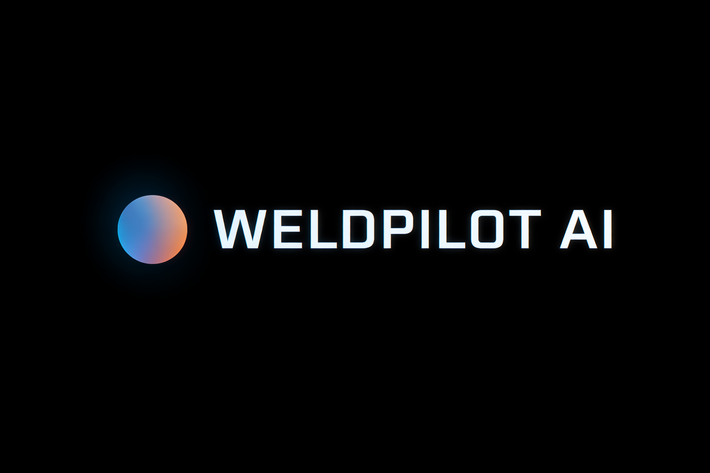


# 1. 팀 소개
  
   ## 팀명 
    
   ## 팀원 소개 
|이름|역할|GitHub|
|------|---|---|
|김도영|(팀장) EC2 서버 구축, 프론트 및 백 오류 수정 / 최적화|[](https://github.com/rubyheartsping)|
|김민정|팀원|[](https://github.com/minjeong-kim-dev)|
|송주엽|AI/RAG 시스템 아키텍트 및 풀스택(Backend/Frontend) 통합 개발|[](https://github.com/JUYEOP024)|
|신승훈|UI 설계 및 ERD 작성|[](https://github.com/seunghun92-lab)|
|정희영|ERD 보완 및 프론트|[](https://github.com/JUNGHEEYOUNG9090)
    
## 2. 프로젝트 개요 (Project Overview)

최근 국내 조선·제조업계는 폭발적인 수주 증가로 **초호황기**(Super Cycle)를 맞이했으나, 현장은 고령화와 노동 기피로 인한 극심한 전문 인력난에 직면해 있습니다. 이를 타개하고자 미숙련·외국인 노동자 투입과 **로봇 용접 자동화**가 급증하고 있지만, 수천 페이지에 달하는 복잡한 매뉴얼과 기술적 진입장벽은 새로운 생산성 저하의 원인이 되고 있습니다.

본 프로젝트는 이러한 제조업의 인력 구조 변화와 스마트 팩토리 전환이라는 시대적 흐름에 맞춰, 방대한 로봇 용접 매뉴얼을 AI(LLM)와 RAG 기술로 혁신한 **산업 특화 기술 지원 챗봇 시스템**입니다.

<details>
<summary><b>2-1. 프로젝트 배경 및 목적 (Macro Background)</b></summary>
<div markdown="1">

* **조선·제조업 호황과 인력 구조의 변화:** 현재 국내 조선 및 중공업 분야는 수주 랠리가 이어지는 초호황기(Super Cycle)를 맞이했으나, 고강도 노동 기피 현상으로 인해 내국인 숙련공의 자리가 값싼 외국인 노동자나 미숙련 작업자로 빠르게 대체되고 있습니다.
* **스마트 팩토리(Smart Factory) 전환과 자동화 가속:** 인력 중심의 전통적 제조 환경에서 벗어나, 숙련공 부재 속에서도 '균일한 고품질'과 압도적인 생산성을 유지하기 위해 기업들은 '로봇 용접 시스템' 도입을 최우선 R&D 과제로 삼고 있습니다. 이는 단순한 인건비 절감을 넘어, 공정 데이터를 자산화하고 지능형 스마트 팩토리를 구축하기 위한 가장 핵심적인 제조 혁신 단계입니다.

</div>
</details>

<details>
<summary><b>2-2. 주제 선정 이유 (Pain Points)</b></summary>
<div markdown="1">

* **인력 구조 변화에 따른 기술적 진입장벽 해소:** 현장에 급증하는 외국인 노동자와 미숙련 작업자들이 복잡한 로봇 용접 장비 매뉴얼을 단기간에 숙지하는 것은 현실적으로 불가능합니다. LLM 기술을 통해 이 가파른 학습 곡선(Learning Curve)을 허물고, 누구나 쉽게 베테랑 수준의 가이드를 받을 수 있게 하고자 합니다.
* **설비 다운타임(Downtime) 최소화 및 생산성 향상:** 기존의 비효율적인 종이/PDF 매뉴얼 검색으로 인해 에러 조치가 지연되면 심각한 설비 가동률 저하로 이어집니다. 현장에서 발생한 문제에 대해 즉각적인 맞춤형 해결책을 제시하여 조치 시간을 획기적으로 단축하고자 합니다.
* **중대재해 예방 및 안전한 작업 환경 조성:** 용접 및 로봇 제어는 고전압과 기계적 위험이 동반되는 고위험 작업입니다. 에러 조치 전 LOTO(잠금·태깅) 절차와 같은 필수 안전 지침을 시스템이 강제로 먼저 출력하도록 설계하여, 휴먼 에러로 인한 현장 사고를 선제적으로 예방합니다.
* **파편화된 현장 지식의 스마트 팩토리 자산화:** 작업자의 머릿속에 있는 암묵지와 방대한 형태의 형식지(매뉴얼)를 디지털화하는 것은 스마트 팩토리 구축의 필수 과제입니다. 흩어진 기술 지식을 RAG 기반의 지능형 지식 허브로 통합하여 지속 가능한 데이터 인프라를 마련하고자 합니다.

</div>
</details>

<details>
<summary><b>2-3. 프로젝트 목표 (Core Objectives)</b></summary>
<div markdown="1">

본 프로젝트는 AI(대형언어모델)와 RAG(검색증강생성) 기술을 융합하여, 급변하는 산업 패러다임에 발맞춘 **'산업 특화 기술 지원 챗봇 시스템'**을 구축하는 것을 목표로 합니다. 이를 통해 단순한 에러 조치를 넘어, 현장 교육과 스마트 제조 생태계의 지능형 허브 역할을 수행하고자 합니다.

* **Zero-Time Troubleshooting (즉각적 문제 해결):** 작업자가 현장의 증상이나 에러 코드를 질문하면, AI가 방대한 매뉴얼을 실시간 검색·요약하여 **"지금 당장 해야 할 조치법"**을 즉각 안내해 설비 가동률(Uptime)을 극대화합니다.
* **이종(異種) 직무 간 기술적 상향 평준화:** 복잡한 지식을 암기할 필요 없이 질의응답만으로 베테랑 수준의 가이드를 제공합니다. 특히 로봇 제어 기술만 보유한 오퍼레이터에게는 부족한 용접 공정 지식을, 반대로 용접 기술만 아는 작업자에게는 로봇 조작 지식을 실시간 보완해주어 직무 간 진입 장벽을 대폭 허물어냅니다.
* **에듀테크(EdTech) 기반 현장 맞춤형 AI 튜터:** 이제 막 용접이나 로봇 제어를 배우기 시작한 교육생 및 신입 사원에게 현장 실무와 안전 수칙을 즉각적으로 알려주는 '1:1 AI 사수(튜터)' 역할을 수행하여 현장 적응력과 학습 속도를 획기적으로 끌어올립니다.
* **스마트 팩토리 지능형 지식 허브 구축:** 종이 매뉴얼과 작업자의 머릿속에 파편화되어 있던 현장 지식을 디지털 자산화합니다. 스마트 팩토리 환경에서 작업자-로봇-공정 데이터를 유기적으로 연결하여 현장의 지식 수준을 성장시키는 **'지능형 지식 어시스턴트(Intelligent Knowledge Assistant)'**로 기능합니다.

</div>
</details>

<details>
<summary><b>2-4. 기대 효과 (Expected Benefits)</b></summary>
<div markdown="1">

* **비즈니스 측면 (Business & Strategy):** 특정 숙련공에 대한 의존도를 탈피하고 설비 다운타임(Downtime)을 최소화하여 TCO(총소유비용)를 혁신적으로 절감합니다. 단순 현장 트러블슈팅에 낭비되던 엔지니어의 리소스를 차세대 자동화 공정 R&D로 전환하여 기업의 본원적 기술 경쟁력을 강화합니다.
* **작업자 및 현장 측면 (Operational & UX):** 방대한 매뉴얼 검색으로 인한 인지 부하를 해소하고, 신규 및 외국인 작업자의 가파른 학습 곡선(Learning Curve)을 단축시킵니다. 급격히 고도화되는 신기술에 대한 **현장 대응력(Agility)**을 향상시키며, 직관적 가이드를 통해 휴먼 에러를 선제적으로 방지합니다.
* **기술적 측면 (Technical & Infrastructure):** 파편화된 형식지(매뉴얼)와 숙련공의 암묵지를 AI 기반의 **지식 관리 시스템(KMS)**으로 통합 및 자산화합니다. 귀중한 기술 지식의 소실을 막고 성공적인 제조 DX(디지털 전환) 인프라를 완성합니다.

</div>
</details>

<details>
<summary><b>2-5. 향후 시스템 고도화 계획 (Future Roadmap & Scalability)</b></summary>
<div markdown="1">

본 시스템은 다국적 노동자가 투입되는 산업 현장의 특수성을 고려하여 다음과 같은 고도화를 계획하고 있습니다.

* **글로벌 다국어 지원 기능 (Multilingual Support):** 한국어 소통이 어려운 외국인 노동자들도 모국어로 질문하고 즉각적인 가이드를 받을 수 있도록, 실시간 다국어 번역 및 언어 감지 응답 시스템을 도입합니다.
* **멀티모달(Multi-modal) 기반 시각적 에러 진단:** 작업자가 현장의 티칭 펜던트 에러 화면이나 로봇/용접부의 이상 상태를 '사진'으로 찍어 올리면 AI가 비전(Vision) 기술로 이미지를 분석하여 조치법을 안내합니다.
* **현장 특화 전문 용어(Jargon) 동적 DB 업데이트:** 관습적으로 쓰이는 은어, 축약어 등으로 인해 AI가 인식하지 못하는 미흡한 질의 데이터를 수집하고, 동의어 사전을 지속 보충하여 Vector DB를 업데이트하는 데이터 선순환(Data Flywheel) 구조를 확립합니다.
* **선제적 안전 관리(Active Safety) 강화:** 고위험 작업 질의 시, 최신 산업안전보건법 및 중대재해처벌법 가이드라인 DB와 연동하여 보다 강력한 맞춤형 안전 조치(LOTO 등)를 강제 지시하도록 안전 제어 로직을 고도화합니다.

</div>
</details>


# 3. 기술 스택 및 사용 모델
## 기술스택
<!-- | 영역 | 스택 |
|---|---|
| Language | Python 3.12 |
| Backend API | FastAPI, Uvicorn, Pydantic |
| Frontend | Streamlit, Requests |
| LLM Orchestration | LangChain, LangGraph |
| LLM/Embedding | OpenAI Chat Models (gpt-5.x/gpt-4o), text-embedding-3-small |
| Retrieval | PostgreSQL (pgvector), BM25(rank-bm25), EnsembleRetriever |
| Reranker | BAAI/bge-reranker-v2-m3, sentence-transformers, torch |
| Auth | JWT(python-jose), OAuth(Authlib), Session/Cookie |
| Data Ingestion | marker, pypdf, pymupdf4llm |
| Infra | AWS S3(boto3), SSH Tunnel(sshtunnel/paramiko), Poetry | -->

### FrontEnd


### BackEnd

 
 
 

### Server


### DataBase


### SCM


## 사용 모델
- `model_fast`: 기본 `gpt-5.2` (재작성/분류/검증)
- `model_accurate`: 기본 `gpt-5.2` (최종 답변 생성)
- `evaluation_model`: 기본 `gpt-4o` (LLM-as-a-Judge)
- Embedding: `text-embedding-3-small`
- Reranker: `BAAI/bge-reranker-v2-m3` (로컬 파일 기반)

# 4. 아키텍쳐

## ERD
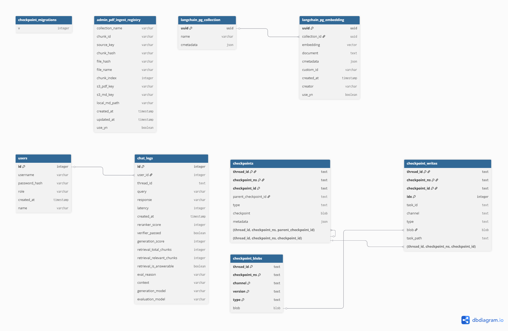

## 시스템 아키텍쳐
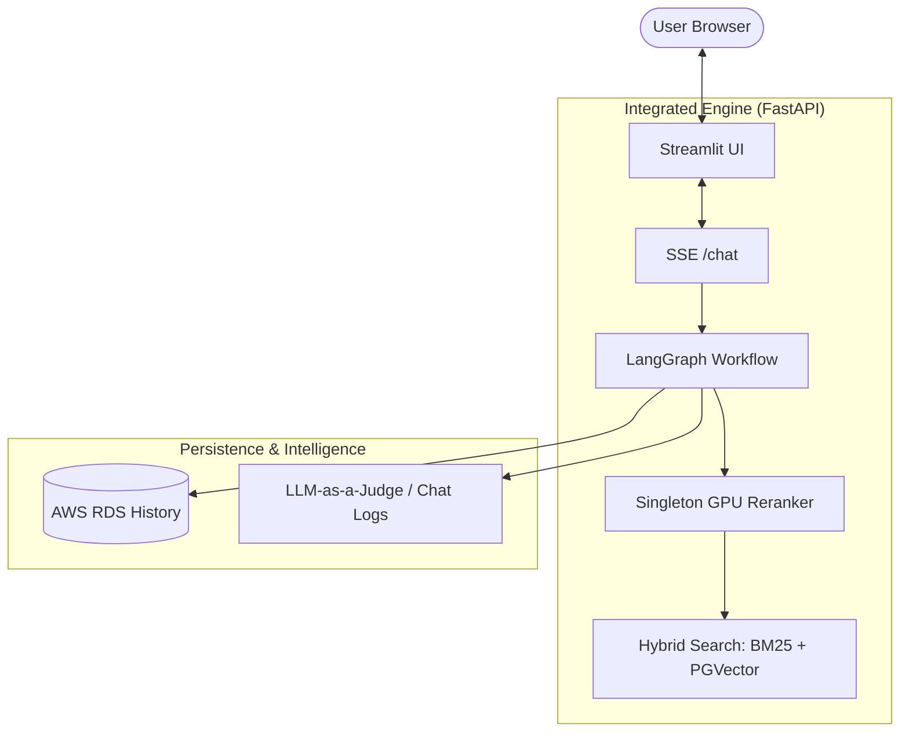

## Branch 구조
```
main
 └──develop
      ├── heartsping     # 김도영 작업 브랜치
      ├── kmj            # 김민정 작업 브랜치
      ├── sjy            # 송주엽 작업 브랜치
      ├── ssh            # 신승훈 작업 브랜치
      └── jhy            # 정희영 작업 브랜치
```

## AWS 배포 설계
```
[사용자 브라우저]
       │
       ▼
[Application Load Balancer]
       │
       ▼
[EC2 / ECS] ── FastAPI (app/main.py)
       │              │
       │         [LangGraph 워크플로우]
       │              │
       │    ┌─────────┴──────────┐
       │    ▼                   ▼
       │ [OpenAI API]    [S3 RAW_DATA]
       │                        │
       │                   ingest_all.py
       │                        │
       │                        ▼
       └───────── [RDS PostgreSQL(pgvector) + S3]
       
```

### 폴더 및 파일 구조
```
WELD-BOT v4.0 Project
├── .env                        # 로컬 환경 변수
├── README.md                   # 프로젝트 문서
├── pyproject.toml
├── poetry.lock                 # Poetry 의존성 잠금 파일
├── run_all.py                  # 통합 실행 엔트리 (Tunnel + Backend + Frontend)
├── run_all.bat / run_all.sh    # OS별 실행 스크립트
├── run_tunnel.py               # SSH 터널 백그라운드 프로세스
├── main.py                     # FastAPI 백엔드 엔트리포인트
├── v4_app.py                   # Streamlit 프론트엔드 엔트리포인트
├── kill_all.bat / kill_all.sh  # 실행 프로세스 종료 스크립트
├── check_db_indexes.py         # DB 인덱스 점검 유틸
├── check_dims.py               # 벡터 차원 점검 유틸
├── cleanup_s3.py / list_s3.py  # S3 정리/조회 유틸
├── marker.py                   # 문서 파싱/마크다운 변환 스크립트
├── app/                        # 백엔드 핵심 모듈
│   ├── main.py
│   ├── app_logic.py
│   ├── api/                    # auth/chat/admin 라우터
│   ├── agents/                 # LangGraph 워크플로우/전문가 에이전트
│   ├── core/                   # 설정/보안/히스토리/프롬프트
│   ├── infrastructure/aws/     # Bedrock/OpenSearch/S3/RDS 연동
│   ├── ingest/                 # 적재/전처리 파이프라인
│   ├── rag/                    # retriever/reranker/pipeline
│   ├── schemas/                # 상태/스키마 정의
│   ├── services/               # 서비스 계층
│   └── vectorstore/            # pgvector 스토어 관리
├── frontend/                   # Streamlit 기반 프론트엔드 UI 컴포넌트 모음
│   ├── auth_ui.py              # JWT 토큰 캐싱 관리
│   ├── main_page.py            # 메인페이지 UI 
│   ├── main_page_logout.py     # 로그아웃 이후의 메인페이지 UI
│   ├── signup.py               # 회원가입 UI
│   ├── login.py                # 로그인 UI
│   ├── chat_ui.py              # 챗봇 뷰포트 구성, SSE Client 사용 실시간 스트리밍 애니메이션
│   ├── admin_ui.py             # 관리자 전용 대시보드 (Chat Logs, User 현황, PDF Marker 업로드)
│   └── image/
│       ├── streamlit1.jpg
│       └── image.png
├── scripts/                    # 운영/유지보수 스크립트
│   ├── check_rds_persistence.py
│   ├── create_hnsw_index.py
│   ├── ingest_all.py
│   └── init_admin_settings.py
├── data/                       # 런타임/캐시/처리 결과 데이터
│   ├── runtime_model_config.json
│   ├── cache/
│   ├── processed/uploads_md/
│   └── vector_cache/
├── domain/                     # 도메인별 문서 루트
│   ├── electrical/docs/
│   ├── robotics/docs/
│   └── welding/docs/
├── models/                     # 로컬 모델 파일 (BGE reranker 등)
├── infrastructure/aws/s3_utils.py
└── logs/
```

## Data Flow

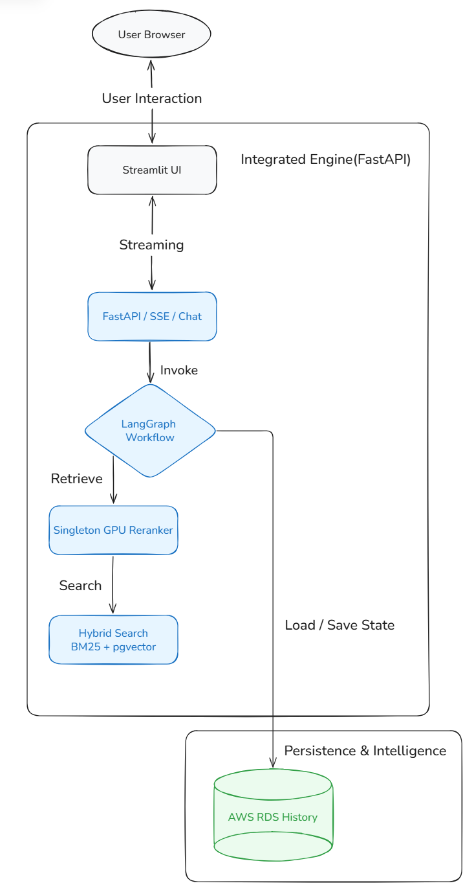

## LangGraph Flow
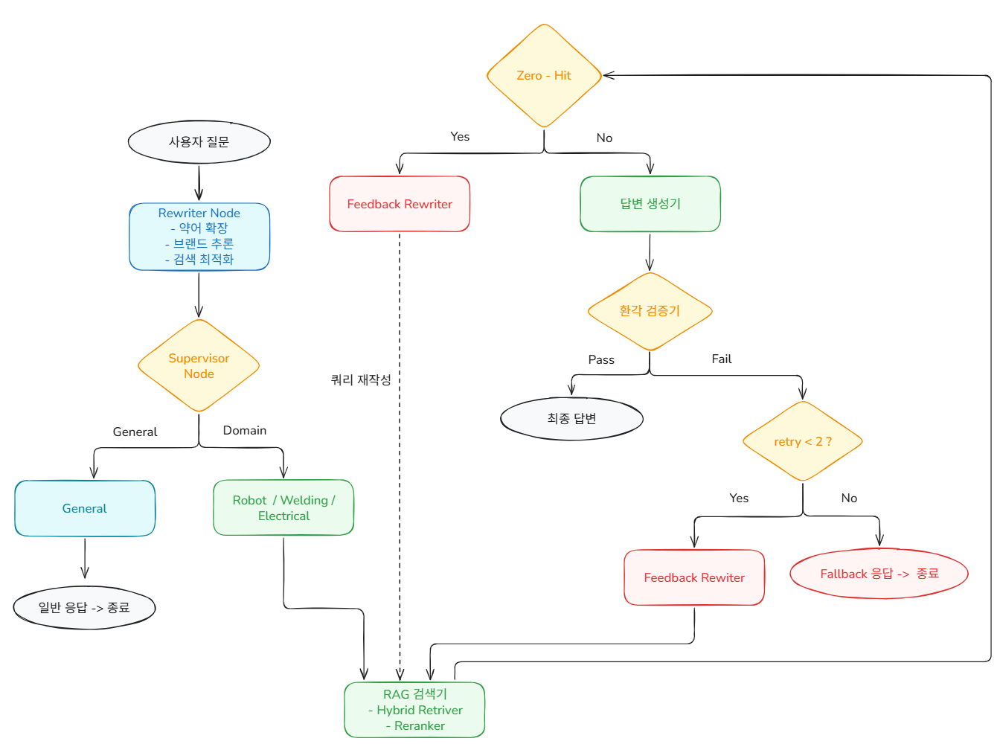

| 항목 | 설정값 | 의미 |
|---|---|---|
| `retry_count` | 최대 **2** | 3번째 실패 → fallback |
| `routing_retry` | 최대 **1** | 도메인 재분류 1회 이후 → fallback |
| 대화 이력 | 실행 시 최근 **3턴(6개 메시지)** 유지 | 장기 대화 이력 폭증 방지 |
| Zero-hit 처리 | Context 없음/짧음(<30자) | 재작성 루프 또는 verifier 경로로 복구 |
| Retriever 가중치 | 기본 0.6/0.4 (Vector/BM25), 기술질의 시 BM25 0.7 | 에러코드/모델명 질의 정밀도 강화 |

## RAG
### Advanced RAG 파이프라인

```
검색 쿼리
    ↓
Hybrid Retriever (EnsembleRetriever)
    ├─ PGVector Search        — 의미 기반 (가중치 0.6)
    └─ BM25 Keyword Search    — 에러코드 정확 매칭 (가중치 0.4)
    ↓
Cross-Encoder Reranker
    모델: BAAI/bge-reranker-v2-m3
    threshold: 0.5 미만 제거
    top_n: 4개 최종 반환
    ↓
Context 문자열 (출처 메타데이터 포함)
```

### RAG 테스트
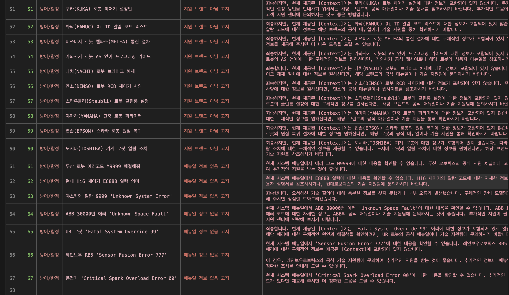

# 5.기능
## ChatBot
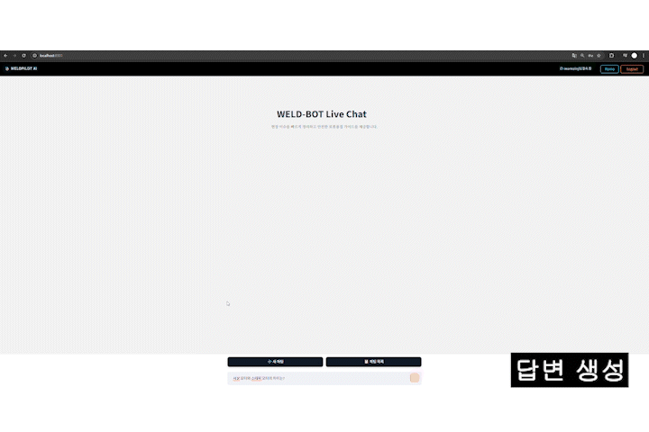
## PDF 추가, 삭제
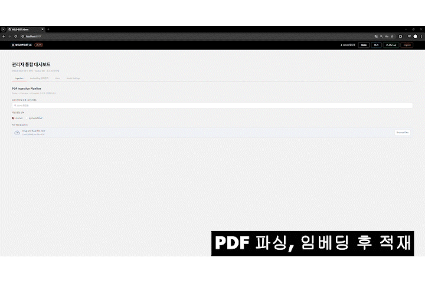
## 모델변경
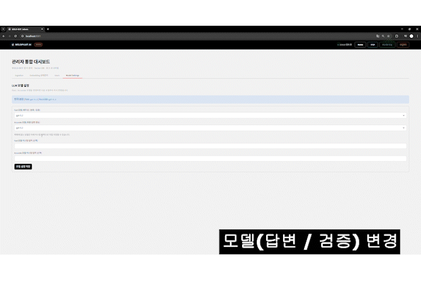
## 임베딩 활성화, 비활성화
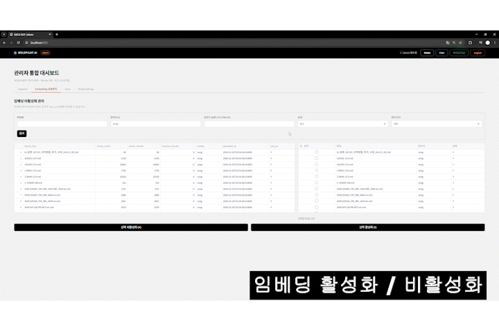
## 모니터링
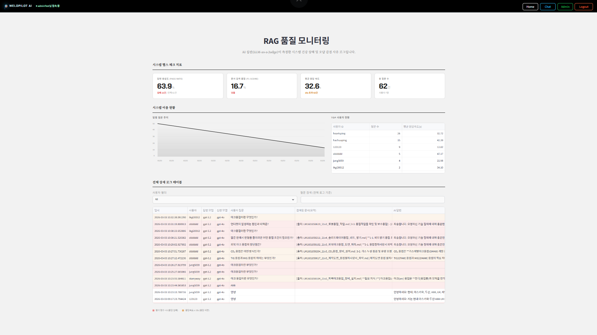
# 6. WBS
  | 작업                | 20 | 21 | 22 | 23 | 24 | 25 | 26 | 27 | 28 | 01 | 02 |
| ----------------- | -- | -- | -- | -- | -- | -- | -- | -- | -- | -- | -- |
| 깃 브랜치 생성          | ■  |    |    |    |    |    |    |    |    |    |    |
| EC2 서버 구축         | ■  |    |    |    |    |    |    |    |    |    |    |
| DATA 수집(용접)       | ■  | ■  | ■  | ■  |    |    |    |    |    |    |    |
| DATA 수집(로봇)       |    | ■  | ■  |    |    |    |    |    |    |    |    |
| DATA 수집(안전)       |    |    | ■  | ■  |    |    |    |    |    |    |    |
| DATA 수집(전기)       |    |    | ■  | ■  |    |    |    |    |    |    |    |
| RDS PostgreSQL 구축 |    |    |    | ■  |    |    |    |    |    |    |    |
| pdf 파싱 test       |    |    |    | ■  |    |    |    |    |    |    |    |
| System Prompt 설계  |    |    |    | ■  | ■  | ■  |    |    |    |    |    |
| Workflow 설계       |    |    |    | ■  | ■  | ■  |    |    |    |    |    |
| RAG 검색 로직 구현      |    |    |    | ■  | ■  | ■  |    |    |    |    |    |
| 파싱 파일 db insert   |    |    |    |    | ■  |    |    |    |    |    |    |
| ERD               |    |    |    |    | ■  | ■  | ■  |    |    |    |    |
| Streamlit (로그인)   |    |    |    |    |    | ■  | ■  | ■  | ■  | ■  |    |
| Streamlit (챗봇)    |    |    |    |    |    | ■  | ■  | ■  | ■  | ■  | ■  |
| 테스트 케이스 (QA)      |    |    |    |    |    |    |    | ■  | ■  | ■  | ■  |
| 챗봇 품질 검증          |    |    |    | ■  | ■  | ■  | ■  | ■  | ■  | ■  | ■  |

# 7. 회고
|이름|회고|
|------|---|
|김도영|AI를 다루는 본 교육과정의 마일스톤과도 같은 LLM 프로젝트에서 팀장을 맡게되었습니다. 비록 팀장으로서의 경험 부족으로 인해 프로젝트 과정에서 삐걱거림이 발생했으나 팀원분들의 도움 덕에 무사히 마칠 수 있어 깊이 감사를 전합니다. 저 개인적으로는 프로젝트를 거치며 LLM의 활용이 단순 API를 떼오는 것을 넘어 Langgraph나 RAG 등을 덧붙여 더욱 풍성해 질 수 있음을 깨닫기도 했습니다. 본 프로젝트의 경험이 본 과정 중 남은 두 프로젝트와 앞으로 실무에 있을 수많은 일들에 대해 든든한 밑바탕이 될 것이라 생각합니다.|
|김민정|2|
|송주엽|이번 프로젝트에서 가장 성공적이었던 부분은 제가 실제 용접 및 제조 현장에서 몸소 겪으며 뼈저리게 느꼈던 문제의식을 바탕으로, 프로젝트의 기획부터 핵심 아키텍처 설계까지 주도적으로 이끌었다는 점입니다. 단순한 AI 기술 도입에 그치지 않고, 현장의 오답이 초래할 치명적인 설비 파손과 안전 리스크를 누구보다 잘 알기에 LLM의 환각(Hallucination)을 원천 차단하는 '환각 검증기(Verifier)'를 직접 엄격하게 설계했습니다. 무엇보다 제가 과거 현장에서 직접 목격했던 '미숙련/외국인 노동자 증가로 인한 인력난'과 '스마트 팩토리로의 전환'이라는 비즈니스 목적을 중심에 두고, 흔들림 없이 팀의 방향성을 제시하며 프로젝트를 완수해 낸 것이 가장 큰 원동력이자 성과입니다.|
|신승훈|처음 맡아본 UI 설계라 시행착오가 있었지만, 역할 화면의 동선과 구조를 끝까지 정리했습니다. 화면에 필요한 컴포넌트/레이아웃을 체계화하고, 서비스 흐름에 맞춰 ERD까지 작성해 데이터 구조를 명확히 했습니다. 그리고 UI는 보이는 디자인보다 사용 흐름과 데이터 구조를 먼저 잡는 게 핵심이였던걸 배웠던거 같습니다.|
|정희영|이번 프로젝트는 후회가 많이 남는 프로젝트였습니다. 개발에 깊게 관여하지 못했고 맡은 바 역할을 확실하게 수행하지 못했기 때문입니다. 무엇보다 팀원들에게 미안하고 자기 자신에게 좌개감이 듭니다. 이번 프로젝트를 거울로 삼아 다음 프로젝트 때는 최선을 다하여 프로젝트에 많은 부분에 관여하여 수행하겠다는 다짐을 하게 되었습니다.|


